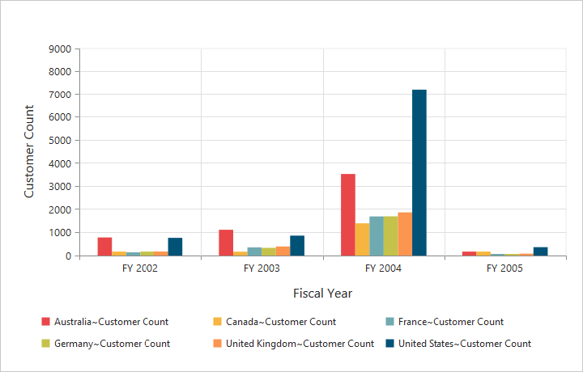
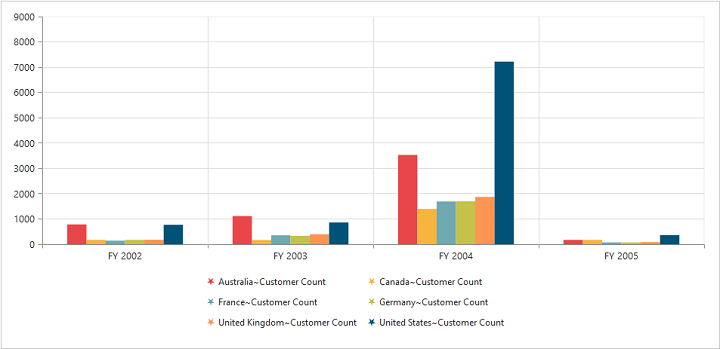

# Legend

## Legend visibility

You can enable or disable the legend by using the `visible` property in the `legend` object.

N> By default, the legend is visible in the pivot chart.



	

		<ej:pivotChart id="PivotChart1 load="onLoad">
		//...
		</ej:pivotChart
	

	



 

## Legend shape
You can customize the legend `shape` in the pivot chart control. The default value of legend shape is rectangle. Following are the legend shapes that are supported:

* Rectangle
* Circle
* Cross
* Diamond
* Pentagon
* Hexagon
* Star
* Ellipse
* Triangle and so on.



	

		<ej:pivotChart id="PivotChart1 load="onLoad">
		//...
		</ej:pivotChart
	

	



 

## Legend position
By using the `position` property, you can place the legend at top, bottom, left, or right of the pivot chart.

N> The default value of legend position is bottom in the pivot chart.



	

		<ej:pivotChart id="PivotChart1 load="onLoad">
		//...
		</ej:pivotChart
	

	



 

## Legend title
To add the legend title, you should specify the title text in the `title.text` property.



	

		<ej:pivotChart id="PivotChart1 load="onLoad">
		//...
		</ej:pivotChart
	

	



 

## Legend alignment
You can align the legend to center, far, and near based on its position in the chart area using the `alignment` option.
 


	

		<ej:pivotChart id="PivotChart1 load="onLoad">
		//...
		</ej:pivotChart
	

	



## Legend items - size and border
By using the legend `itemStyle.width`, `itemStyle.height`, and `itemStyle.border` properties, you can change the size and border of legend items.



	

		<ej:pivotChart id="PivotChart1 load="onLoad">
		//...
		</ej:pivotChart
	

	



 
## Legend border
By using the `border` option in legend, you can customize the border color and width.



	

		<ej:pivotChart id="PivotChart1 load="onLoad">
		//...
		</ej:pivotChart
	

	



## Legend text
By using the `font` option, you can customize the font family, font style, font weight, and size of the legend text.



	

		<ej:pivotChart id="PivotChart1 load="onLoad">
		//...
		</ej:pivotChart
	

	



