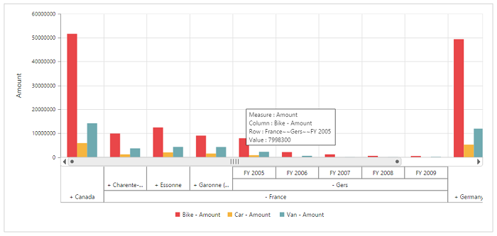

# Multi-level labels

Multi-level labels allows you to drill down to access the detailed level of data or drill up to see the summarized data by using the expander present in the pivot chart.



	

		<ej:pivotChart id="PivotChart1 enableMultiLevelLabels="true">
		//...
		<ej:pivotChart-commonSeriesOptions type="column"></ej:pivotChart-commonSeriesOptions>
		</ej:pivotChart
	



## Relational

## OLAP

