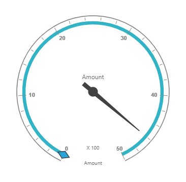

# Getting started

This section explains how to populate the pivot gauge in your application with **JSP** wrapper classes of EJ controls. This section covers only the minimal features that are needed to get started with the pivot gauge.

## Create pivot gauge widget

You can create a JSP application and add necessary scripts and styles with the help of the given [JSP Getting Started Documentation.](/jsp/Getting-Started)

Refer to the required scripts and CSS files in your JSP page as mentioned below to render the pivot gauge control:



<!DOCTYPE html>
<html>
	<head>
			<title>Getting Started - PivotGauge</title>
			<link href="http://cdn.syncfusion.com/{{ site.releaseversion }}/js/web/flat-azure/ej.web.all.min.css" rel="stylesheet" />
			<link href="http://cdn.syncfusion.com/{{ site.releaseversion }}/js/web/responsive-css/ej.responsive.css" rel="stylesheet" />
			
			
			
	</head>
</html>



## Relational

Add the following code example to add list of items to the **pivot gauge** and initialize the **pivot gauge** widget with relational data source.



<ej:pivotGauge id="PivotGauge1" isResponsive="true" enableTooltip="true" load="loadData" beforePivotEnginePopulate="beforePivotEnginePopulate">
<ej:pivotGauge-dataSource>
<ej:pivotGauge-dataSource-rows>
<ej:pivotGauge-dataSource-row fieldName="Date" ></ej:pivotGauge-dataSource-row>
</ej:pivotGauge-dataSource-rows>
<ej:pivotGauge-dataSource-columns>
<ej:pivotGauge-dataSource-column fieldName="Country" ></ej:pivotGauge-dataSource-column>
</ej:pivotGauge-dataSource-columns>
<ej:pivotGauge-dataSource-values>
<ej:pivotGauge-dataSource-value fieldName="Amount" ></ej:pivotGauge-dataSource-value>
</ej:pivotGauge-dataSource-values>
</ej:pivotGauge-dataSource>
<ej:pivotGauge-labelFormatSettings decimalPlaces="2"></ej:pivotGauge-labelFormatSettings>
</ej:pivotGauge>



The above code will generate a simple pivot gauge with relational data source as shown in the following screenshot:

## OLAP

Add the following code example to add list of items to the **pivot gauge** and initialize the **pivot gauge** widget with OLAP data source.



<ej:pivotGauge id="PivotGauge1" isResponsive="true" enableTooltip="true" beforePivotEnginePopulate="beforePivotEnginePopulate">
<ej:pivotGauge-dataSource data="//bi.syncfusion.com/olap/msmdpump.dll" catalog="Adventure Works DW 2008 SE" cube="Adventure Works">
<ej:pivotGauge-dataSource-rows>
<ej:pivotGauge-dataSource-row fieldName="[Date].[Fiscal]"></ej:pivotGauge-dataSource-row>
</ej:pivotGauge-dataSource-rows>
<ej:pivotGauge-dataSource-columns>
<ej:pivotGauge-dataSource-column fieldName="[Customer].[Customer Geography]"></ej:pivotGauge-dataSource-column>
</ej:pivotGauge-dataSource-columns>
<ej:pivotGauge-dataSource-values>
<ej:pivotGauge-dataSource-value axis="columns">
<ej:pivotGauge-dataSource-value-measures>
<ej:pivotGauge-dataSource-value-measure fieldName="[Measures].[Internet Sales Amount]"></ej:pivotGauge-dataSource-value-measure>
</ej:pivotGauge-dataSource-value-measures>
</ej:pivotGauge-dataSource-value>
</ej:pivotGauge-dataSource-values>
</ej:pivotGauge-dataSource>
<ej:pivotGauge-labelFormatSettings decimalPlaces="2"></ej:pivotGauge-labelFormatSettings>
</ej:pivotGauge>



The above code will generate a simple pivot gauge with OLAP data source as shown in the following screenshot:

