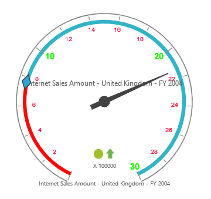

# Labels

## Adding label collection

The label collection can be directly added to the scales option within the pivot gauge control.



<ej:pivotGauge id="PivotGauge1" beforePivotEnginePopulate="beforePivotEnginePopulate">
    //...
</ej:pivotGauge>



## Appearance customization

The appearance of the label can be customized by using the following properties:

* **angle**: Displays labels in a rotated manner. By default, the value is 0.
* **color**: Displays the label in specified color.
* **opacity**: Sets the opacity of the label. By default, the value is 1.
* **type**: Indicates the label for major intervals or minor intervals.  By default, it takes major intervals.
* **includeFirstValue**: Includes the initial value based on user requirement.  By default, the value is true.
* **font**: Sets the font size, font style, and font family of the label.



<ej:pivotGauge id="PivotGauge1" beforePivotEnginePopulate="beforePivotEnginePopulate">
    //...
</ej:pivotGauge>



 

## Unit text

The `unitText` property is used to add some text along with labels. Normally, the unit/measurement of the numeric value is indicated through a unit text. By using the `unitTextPosition` property, the text can be positioned either in front or back.

N> By default, the text appears at the back.



<ej:pivotGauge id="PivotGauge1" beforePivotEnginePopulate="beforePivotEnginePopulate">
    //...
</ej:pivotGauge>



 

