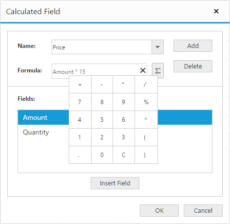
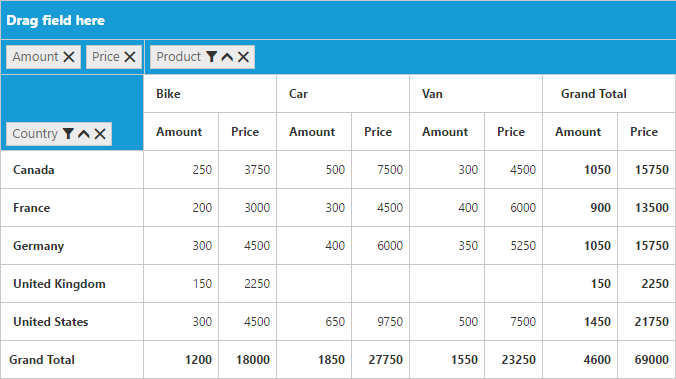

# Calculated field

N> This feature is applicable only for the relational data source.

The pivot grid provides support to insert a new calculated field based on existing pivot fields through the Calculated Field dialog or code behind.

### Through UI
To insert a new calculated Field, open the Calculated Field dialog using the grouping bar context menu. You can define "Name" for the new calculated field and "Formula" can be entered by inserting required fields through the fields section. For inserting numbers and operators, you can use formula pop-up as shown in the following screenshot:

Click **Add** to add the respective Calculated Field and **OK** to populate the pivot grid control.

### Through code-behind

The calculated field can be created at code-behind by defining formula based on existing Pivot Fields in the pivot grid. To indicate a field as a calculated field, set the `isCalculatedField` property to true and `formula` property to set the expression.



<ej:pivotGrid id="PivotGrid1" load="onLoad">
<ej:pivotGrid-dataSource>
<ej:pivotGrid-dataSource-rows>
<ej:pivotGrid-dataSource-row fieldName="Product" fieldCaption="Product"></ej:pivotGrid-dataSource-row>
</ej:pivotGrid-dataSource-rows>
<ej:pivotGrid-dataSource-columns>
<ej:pivotGrid-dataSource-column fieldName="Date" fieldCaption="Date"></ej:pivotGrid-dataSource-column>
</ej:pivotGrid-dataSource-columns>
<ej:pivotGrid-dataSource-values>
<ej:pivotGrid-dataSource-value fieldName="Amount" fieldCaption="Amount"></ej:pivotGrid-dataSource-value>
<ej:pivotGrid-dataSource-value fieldName="Price" fieldCaption="Price" isCalculatedField="true" formula="Amount * 15"></ej:pivotGrid-dataSource-value>
</ej:pivotGrid-dataSource-values>
</ej:pivotGrid-dataSource>
</ej:pivotGrid>



