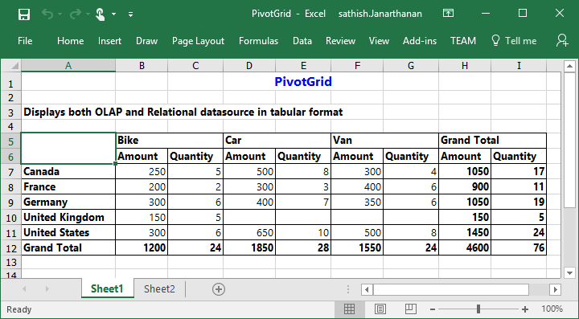

# Exporting

The pivot grid control can be exported to the following file formats:

* Microsoft Excel
* Microsoft Word
* PDF
* CSV

The pivot grid control can be exported by invoking the **“exportPivotGrid”** method with an appropriate export option as a parameter.

## JSON export

### Excel export

You can export the contents of the pivot grid to an Excel document for future archival, references, and analysis purposes.

To achieve Excel export, the URL and the file name are set as parameters.



	

		<ej:pivotGrid id="PivotGrid1">
		//...
		</ej:pivotGrid
	

    

        <ej:button id="button" click="exportButtonClick" showRoundedCorner="true" size="large" text="Export"></ej:button> 
    

    
	

 

### Word export

You can export the contents of the pivot grid to a Word document for future archival, references, and analysis purposes.

To achieve Word export, the URL and the file name are set as parameters.



	

		<ej:pivotGrid id="PivotGrid1">
		//...
		</ej:pivotGrid
	

    

        <ej:button id="button" click="exportButtonClick" showRoundedCorner="true" size="large" text="Export"></ej:button> 
    

    
	

 

### PDF export

You can export the contents of the pivot grid to a PDF document for future archival, references, and analysis purposes.

To achieve Word export, the URL and the file name are set as parameters.



	

		<ej:pivotGrid id="PivotGrid1">
		//...
		</ej:pivotGrid
	

    

        <ej:button id="button" click="exportButtonClick" showRoundedCorner="true" size="large" text="Export"></ej:button> 
    

    
	

 

### CSV export

You can export the contents of the pivot grid to a CSV document for future archival, references, and analysis purposes.

To achieve CSV export, the URL and the file name are set as parameters.



	

		<ej:pivotGrid id="PivotGrid1">
		//...
		</ej:pivotGrid
	

    

        <ej:button id="button" click="exportButtonClick" showRoundedCorner="true" size="large" text="Export"></ej:button> 
    

    
	

 

### Customize the export document name

For customizing file name, set the file name as parameter to the **“exportPivotGrid”** method along with method name.



	

		<ej:pivotGrid id="PivotGrid1">
		//...
		</ej:pivotGrid
	

    

        <ej:button id="button" click="exportButtonClick" showRoundedCorner="true" size="large" text="Export"></ej:button> 
    

    
	

 

## Exporting customization

You can add the title and description to the exporting document by using the title and description properties respectively, obtained in the `beforeExport` event. Similarly, you can enable or disable the styling on the exported document by using the `exportWithStyle` property.



	

		<ej:pivotGrid id="PivotGrid1" beforeExport="BeforeExport">
		//...
		</ej:pivotGrid
	

    

        <ej:button id="button" click="exportButtonClick" showRoundedCorner="true" size="large" text="Export"></ej:button> 
    

    
	

 

### Exporting complete data on paging

When the paging is enabled, you can export the complete data by enabling the `enableCompleteDataExport` property. It is supported in both types of JSON and pivot engine export and it is applicable for all kinds of exporting formats available in the pivot grid.



	

		<ej:pivotGrid id="PivotGrid1" beforeExport="BeforeExport" enableCompleteDataExport="true">
		//...
		</ej:pivotGrid
	

    

        <ej:button id="button" click="exportButtonClick" showRoundedCorner="true" size="large" text="Export"></ej:button> 
    

    
	



The following screenshot shows the pivot grid control exported to an Excel document:

The following screenshot shows the pivot grid control exported to a Word document:

The following screenshot shows the pivot grid control exported to a PDF document:

The following screenshot shows the pivot grid control exported to a CSV document:

