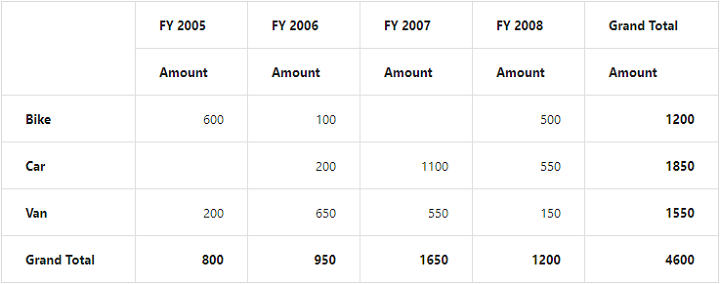

# Getting started

This section explains how to populate the pivot grid in your application with **JSP** wrapper classes of EJ controls. This section covers only the minimal features that are needed to get started with the pivot grid.

## Create pivot grid widget

You can create a JSP application and add necessary scripts and styles with the help of the given [JSP Getting Started Documentation.](/jsp/Getting-Started)

Refer to the required scripts and CSS files in your JSP page as mentioned below to render the pivot grid control:



<!DOCTYPE html>
<html>
	<head>
			<title>Getting Started - PivotGrid</title>
			<link href="http://cdn.syncfusion.com/{{ site.releaseversion }}/js/web/flat-azure/ej.web.all.min.css" rel="stylesheet" />
			<link href="http://cdn.syncfusion.com/{{ site.releaseversion }}/js/web/responsive-css/ej.responsive.css" rel="stylesheet" />
			
			
			
	</head>
</html>



## Relational

Add the following code example to add list of items to the **pivot grid** and initialize the **pivot grid** widget with relational data source.



<ej:pivotGrid id="PivotGrid1" load="onLoad">
<ej:pivotGrid-dataSource>
<ej:pivotGrid-dataSource-rows>
<ej:pivotGrid-dataSource-row fieldName="Product" fieldCaption="Product"></ej:pivotGrid-dataSource-row>
</ej:pivotGrid-dataSource-rows>
<ej:pivotGrid-dataSource-columns>
<ej:pivotGrid-dataSource-column fieldName="Date" fieldCaption="Date"></ej:pivotGrid-dataSource-column>
</ej:pivotGrid-dataSource-columns>
<ej:pivotGrid-dataSource-values>
<ej:pivotGrid-dataSource-value fieldName="Amount" fieldCaption="Amount"></ej:pivotGrid-dataSource-value>
</ej:pivotGrid-dataSource-values>
</ej:pivotGrid-dataSource>
</ej:pivotGrid>



The above code will generate a simple pivot grid with “Product” field in the row, “Date” field in the column, and “Amount” field in the value section.

## OLAP

Add the following code example to add list of items to the **pivot grid** and initialize the **pivot grid** widget with OLAP data source.



<ej:pivotGrid id="PivotGrid1">
<ej:pivotGrid-dataSource catalog="Adventure Works DW 2008 SE" cube="Adventure Works" data="//bi.syncfusion.com/olap/msmdpump.dll">
<ej:pivotGrid-dataSource-rows>
<ej:pivotGrid-dataSource-row fieldName="[Date].[Fiscal]"></ej:pivotGrid-dataSource-row>
</ej:pivotGrid-dataSource-rows>
<ej:pivotGrid-dataSource-columns>
<ej:pivotGrid-dataSource-column fieldName="[Customer].[Customer Geography]"></ej:pivotGrid-dataSource-column>
</ej:pivotGrid-dataSource-columns>
<ej:pivotGrid-dataSource-values>
<ej:pivotGrid-dataSource-value axis="columns">
<ej:pivotGrid-dataSource-value-measures>
<ej:pivotGrid-dataSource-value-measure fieldName="[Measures].[Internet Sales Amount]"></ej:pivotGrid-dataSource-value-measure>
</ej:pivotGrid-dataSource-value-measures>
</ej:pivotGrid-dataSource-value></ej:pivotGrid-dataSource-values>
</ej:pivotGrid-dataSource>
</ej:pivotGrid>



The above code will generate a simple pivot grid with “Fiscal” field in the row, “Customer Geography” field in the column, and “Internet Sales Amount” field in the value section.

