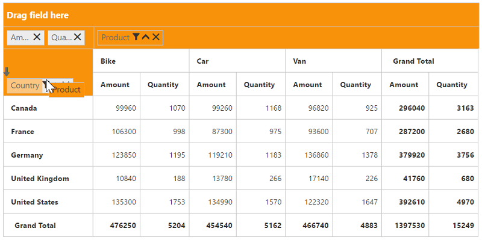
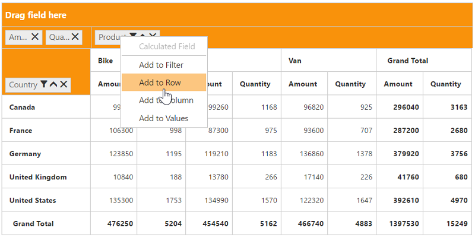
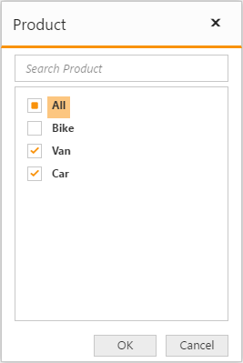
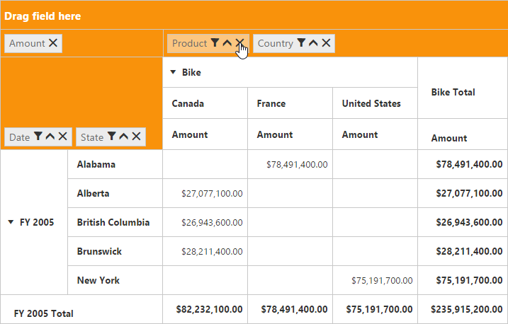

# Grouping bar

## Initialization

Grouping bar allows you to dynamically alter the report by filter, sort, and  remove operations in the pivot grid control. Based on the relational data source and report bound to the pivot grid control, the grouping bar will be automatically populated. You can enable this option in the pivot grid by setting the `enableGroupingBar` property to true.



<ej:pivotGrid id="PivotGrid1" enableGroupingBar="true">
	//...
</ej:pivotGrid>



## Drag and drop

You can alter the report on fly through the drag and drop operation.

## Context menu

You can alter the report by using the context menu.

## Searching values

The search option available in the grouping bar allows you to search a specific value that should be filtered from the list of values in the filter pop-up window.

## Filtering values

The filtering option available in the grouping bar allows you to select a specific set of values that should be displayed in the pivot grid control. At least, one value should be present in checked state while filtering, otherwise, the OK button will be disabled.

## Sorting values

The sorting option available in the grouping bar allows you to arrange headers in the ascending or descending order. This option is applicable for fields available only in the row and column region. By default, headers are sorted in the ascending order. In the sorting indicator, up arrow denotes the ascending order and down arrow denotes the descending order.

## Removing field

The remove option available in the grouping bar allows you to completely remove a specific field from the pivot grid control. The remove operation can be achieved by clicking remove icon available in each field or by dragging and dropping field out of the grouping bar region.

 

