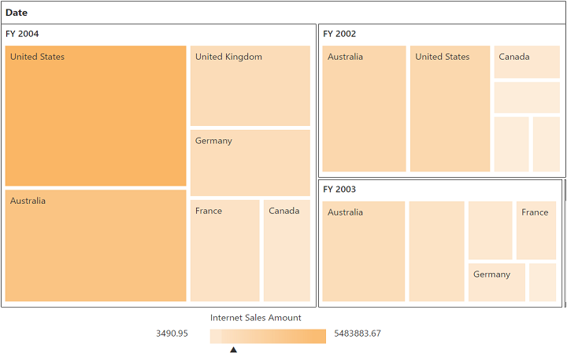

# Getting started

This section explains how to populate the pivot tree map in your application with **JSP** wrapper classes of EJ controls. This section covers only the minimal features that are needed to get started with the pivot tree map.

## Create pivot tree map widget

You can create a JSP application and add necessary scripts and styles with the help of the given [JSP Getting Started Documentation.](/jsp/Getting-Started)

Refer to the required scripts and CSS files in your JSP page as mentioned below to render the pivot tree map control:



<!DOCTYPE html>
<html>
	<head>
			<title>Getting Started - PivotTreeMap</title>
			<link href="http://cdn.syncfusion.com/{{ site.releaseversion }}/js/web/flat-azure/ej.web.all.min.css" rel="stylesheet" />
			<link href="http://cdn.syncfusion.com/{{ site.releaseversion }}/js/web/responsive-css/ej.responsive.css" rel="stylesheet" />
			
			
			
	</head>
	<body>
			<?jsp require_once 'EJ\AutoLoad.jsp'; ?>
	</body>
</html>



Add the following code example to add list of items to the **pivot tree map** and initialize the **pivot tree map** widget with OLAP data source.



<ej:pivotTreeMap id="PivotTreeMap1">
<ej:pivotTreeMap-dataSource catalog="Adventure Works DW 2008 SE" cube="Adventure Works" data="//bi.syncfusion.com/olap/msmdpump.dll">
<ej:pivotTreeMap-dataSource-rowCollections>
<ej:pivotTreeMap-dataSource-rows fieldName="[Date].[Fiscal]"></ej:pivotTreeMap-dataSource-rows>
</ej:pivotTreeMap-dataSource-rowCollections>
<ej:pivotTreeMap-dataSource-columnCollections>
<ej:pivotTreeMap-dataSource-columns fieldName="[Customer].[Customer Geography]"></ej:pivotTreeMap-dataSource-columns>
</ej:pivotTreeMap-dataSource-columnCollections>
<ej:pivotTreeMap-dataSource-valueCollections>
<ej:pivotTreeMap-dataSource-values axis="columns">
<ej:pivotTreeMap-dataSource-values-measureCollections>
<ej:pivotTreeMap-dataSource-values-measure fieldName="[Measures].[Internet Sales Amount]"></ej:pivotTreeMap-dataSource-values-measure>
</ej:pivotTreeMap-dataSource-values-measureCollections>
</ej:pivotTreeMap-dataSource-values>
</ej:pivotTreeMap-dataSource-valueCollections>
</ej:pivotTreeMap-dataSource>
</ej:pivotTreeMap>

 



The above code will generate a simple pivot tree map with internet sales amount over a period of fiscal years across different customer geographic locations.

