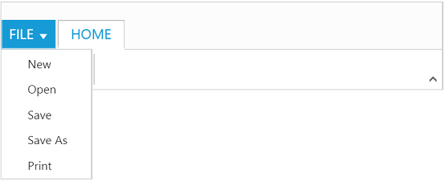

# Application Tab

The Application Tab is used to represent a `Menu` that do some operations, such as File menu to create, open, and print documents. Application Tab classified by `type` property with the following:

*  menu
*  backstage

## Application Menu

The Application Menu is similar to traditional file menu options and Syncfusion `ejMenu` control is used internally to render this. To show Application Menu in Ribbon, set the `type` as `menu` and `menuSettings` to customize properties of `ejMenu`.

### _Create Using Template_

Set the UL element `id` to `menuItemID` property to create Application Menu and it will acts as template to render menu.


    
    <%@ page language="java" contentType="text/html; charset=ISO-8859-1"
    pageEncoding="ISO-8859-1"%><%@ taglib prefix="ej" uri="/WEB-INF/EJ.tld" %><%@ page import="com.syncfusion.*" %><%@ page session="false" import="java.util.ArrayList" %><%@ page session="false" import="java.util.Iterator" %><%@ page session="false" import="org.json.simple.parser.JSONParser" %>
    <link rel="stylesheet" href="Content/ejthemes/ribbon-css/ej.icons.css">
    <body>
    <ul id="ribbonmenu">
        <li>
            <a>FILE</a>
            <ul>
                <li>
                    <a>New</a>
                </li>
                <li>
                    <a>Open</a>
                </li>
                <li>
                    <a>Save</a>
                </li>
                <li>
                    <a>Save As</a>
                </li>
                <li>
                    <a>Print</a>
                </li>
            </ul>
        </li>
    </ul>
    

        <ej:ribbon id="defaultRibbon" width="500px">
            <ej:ribbon-applicationtab type="menu" menuitemid="ribbonmenu"></ej:ribbon-applicationtab>
            <ej:ribbon-tabs>
                <ej:ribbon-tab id="home" text="Home">
                    <ej:ribbon-tab-groups>
                        <ej:ribbon-tab-group text="New" aligntype="rows">
                            <ej:ribbon-tab-group-contentcollection>
                                <ej:ribbon-tab-group-content>
                                    <ej:ribbon-tab-group-content-groups>
                                        <ej:ribbon-tab-group-content-group id="new" text="New" tooltip="New" buttonsettings="${new_buttonSettings}"></ej:ribbon-tab-group-content-group>
                                    </ej:ribbon-tab-group-content-groups>
                                    <ej:ribbon-tabs-groups-content-defaults type="button" height="70" width="60"></ej:ribbon-tabs-groups-content-defaults>
                                </ej:ribbon-tab-group-content>
                            </ej:ribbon-tab-group-contentcollection>
                        </ej:ribbon-tab-group>
                    </ej:ribbon-tab-groups>
                </ej:ribbon-tab>
            </ej:ribbon-tabs>
        </ej:ribbon>
    

    </body>
    </html>


## Backstage Page

The Backstage page is where documents and related data of those can be managed, such as Create, Save and other information.

The Backstage page has a feature to add custom Control in left side of the page which contains menu items and the right side contains corresponding user controls. 

You can set Application Tab `type` as `backstage` and set `id` , `text` to backstage items. Backstage `pages` can be added with required `itemType` and `contentID` as template id to render template into Backstage. 

Separator between Backstage items can be enabled by setting `enableSeparator` as true. Width of back stage side header can be customized using `headerWidth`, If not set based on content given width will be considered.

To render the Ribbon with the Backstage page, refer to the following code snippet. 


    
    <%@ page language="java" contentType="text/html; charset=ISO-8859-1"
    pageEncoding="ISO-8859-1"%><%@ taglib prefix="ej" uri="/WEB-INF/EJ.tld" %><%@ page import="com.syncfusion.*" %><%@ page session="false" import="java.util.ArrayList" %><%@ page session="false" import="java.util.Iterator" %><%@ page session="false" import="org.json.simple.parser.JSONParser" %>
    <link rel="stylesheet" href="Content/ejthemes/ribbon-css/ej.icons.css">
    <body>
    

        <table>
            <tr>
                <td>
                    <button id="btn1" class="e-bsnewbtnstyle">Blank WorkBook</button>
                </td>
            </tr>
        </table>
    

    

        

            User Information
            

                

                

                    
user

                    
xy@syncfusion.com

                

            

        

        <a href="#">Sign out</a>
    

    
Home control

    

        <%
        %>
        <ej:ribbon id="defaultRibbon" width="100%">
            <ej:ribbon-applicationtab type="backstage">
                <ej:ribbon-applicationtab-backstagesettings headerwidth="120" text="File" height="350" width="800">
                    <ej:ribbon-applicationtab-backstagesettings-pages>
                        <ej:ribbon-applicationtab-backstagesettings-page id="new" text="New" contentid="newCon"></ej:ribbon-applicationtab-backstagesettings-page>
                        <ej:ribbon-applicationtab-backstagesettings-page id="close" text="Close" contentid="newCon"></ej:ribbon-applicationtab-backstagesettings-page>
                        <ej:ribbon-applicationtab-backstagesettings-page id="account" text="Office Account" contentid="accountCon"></ej:ribbon-applicationtab-backstagesettings-page>
                    </ej:ribbon-applicationtab-backstagesettings-pages>
                </ej:ribbon-applicationtab-backstagesettings>
            </ej:ribbon-applicationtab>
            <ej:ribbon-tabs>
            </ej:ribbon-tabs>
        </ej:ribbon>
    

    </body>
    
    
    </html>
    


N> Height & width of backstage can be set using `height` and `width`, if these are not set, Ribbon’s height & width will be considered.

You can add/remove/update backStage item to the ribbon control by using [`addBackStageItem`](https://help.syncfusion.com/api/js/ejribbon#methods:addbackstageitem), [`removeBackStageItem`](https://help.syncfusion.com/api/js/ejribbon#methods:removebackstageitem) and [`updateBackStageItem`](https://help.syncfusion.com/api/js/ejribbon#methods:updatebackstageitem) methods. Also you can show/hide the backstage page in ribbon control by using [`showBackstage`](https://help.syncfusion.com/api/js/ejribbon#methods:showbackstage) and [`hideBackstage`](https://help.syncfusion.com/api/js/ejribbon#methods:hidebackstage methods.
