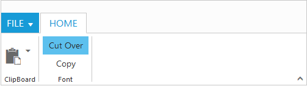

# Group

`Group` is a collection of logical content groups that are combined under related Tab. Each group can be defined using content groups or custom content.

## Adding Tab Groups

Group items can be added to Tabs by specifying `text` and corresponding `content` to be displayed. The content of group can be specified as either with `content` collection, `contentID` or `customContent`. You can add tab group dynamically in the ribbon control with given tab index, tab group object and group index position by using [`addTabGroup`](https://help.syncfusion.com/api/js/ejribbon#methods:addtabgroup) method.

### Adding Content

Add content to Group item which is based on `type` of content specified. The available types are `button`, `splitButton`, `toggleButton`,`gallery`, and `dropDownList`.

Groups and defaults settings can be added with the `content`. You can add group content dynamically in the ribbon control with given tab index, group index, content, content index and sub group index position by using [`addTabGroupContent`](https://help.syncfusion.com/api/js/ejribbon#methods:addtabgroupcontent).

#### _Defaults_

The [`tabs.groups.content.defaults.height`](https://help.syncfusion.com/api/js/ejribbon#members:tabs-groups-content-defaults-height), [`tabs.groups.content.defaults.width`](https://help.syncfusion.com/api/js/ejribbon#members:tabs-groups-content-defaults-width), 
[`tabs.groups.content.defaults.type`](https://help.syncfusion.com/api/js/ejribbon#members:tabs-groups-content-defaults-type), [`tabs.groups.content.defaults.isBig`](https://help.syncfusion.com/api/js/ejribbon#members:tabs-groups-content-defaults-isbig) property to the controls in the [`group`](https://help.syncfusion.com/api/js/ejribbon#members:tabs-groups-content-groups) can be specified commonly.

The `height` & `width` applicable to button, split button, dropdown list ,Toggle button controls and `isBig` applicable to only button controls ( button, split , toggle)

#### _Adding Content Groups_

Controls such as button, split button, dropdown list, toggle button, gallery in the subgroup of the Ribbon tab can be rendered. All of these can be customized using its corresponding settings property such as `buttonSettings`, `dropdownSettings`, etc.

Custom controls or items (such as table, div etc.) can be added when the `type` set as `custom`. `defaults` control settings of group can be specified for an `individual group` instead of specifying them to groups collection commonly.

`Tooltip` and `Custom Tooltip` can be specified for each group controls.


	 
	<%@ page language="java" contentType="text/html; charset=ISO-8859-1"
    pageEncoding="ISO-8859-1"%><%@ taglib prefix="ej" uri="/WEB-INF/EJ.tld" %><%@ page import="com.syncfusion.*" %><%@ page session="false" import="java.util.ArrayList" %><%@ page session="false" import="java.util.Iterator" %><%@ page session="false" import="org.json.simple.parser.JSONParser" %>
    <link rel="stylesheet" href="Content/ejthemes/ribbon-css/ej.icons.css" >
	<body>
		<ul id="ribbonmenu">
			<li>
				<a>FILE</a>
				<ul>
					<li>
						<a>New</a>
					</li>
					<li>
						<a>Open</a>
					</li>
				</ul>
			</li>
		</ul>
		
<%
    JSONParser parser = new JSONParser();
	request.setAttribute("paste_buttonSettings",parser.parse("{\"contentType\": \"imageonly\",\"prefixIcon\": \"e-icon e-ribbon e-ribbonpaste\" }"));
	%>
			<ej:ribbon id="defaultRibbon" width="65%" isResponsive="true">
				<ej:ribbon-applicationTab type="menu" menuItemID="ribbonmenu"></ej:ribbon-applicationTab>
				<ej:ribbon-tabs>
					<ej:ribbon-tab id="home" text="Home">
						<ej:ribbon-tab-groups>
							<ej:ribbon-tab-group text="Clipboard" alignType="rows">
								<ej:ribbon-tab-group-contentCollection>
									<ej:ribbon-tab-group-content>
										<ej:ribbon-tab-group-content-groups>
											<ej:ribbon-tab-group-content-group id="paste" text="paste" toolTip="Paste"  buttonSettings="${paste_buttonSettings}"></ej:ribbon-tab-group-content-group>
										</ej:ribbon-tab-group-content-groups>
										<ej:ribbon-tabs-groups-content-defaults type="button" width="50" height="70" isBig="true"></ej:ribbon-tabs-groups-content-defaults>
									</ej:ribbon-tab-group-content>
								</ej:ribbon-tab-group-contentCollection>
							</ej:ribbon-tab-group>
							<ej:ribbon-tab-group text="Font" alignType="columns">
								<ej:ribbon-tab-group-contentCollection>
									<ej:ribbon-tab-group-content>
										<ej:ribbon-tab-group-content-groups>
											<ej:ribbon-tab-group-content-group id="cut" text="Cut Over" toolTip="Cut"></ej:ribbon-tab-group-content-group>
											<ej:ribbon-tab-group-content-group id="copy" text="Copy" toolTip="Copy" ></ej:ribbon-tab-group-content-group>
										</ej:ribbon-tab-group-content-groups>
										<ej:ribbon-tabs-groups-content-defaults type="button" width="60" isBig="false"></ej:ribbon-tabs-groups-content-defaults>
									</ej:ribbon-tab-group-content>
								</ej:ribbon-tab-group-contentCollection>
							</ej:ribbon-tab-group>
						</ej:ribbon-tab-groups>
					</ej:ribbon-tab>
				</ej:ribbon-tabs>
			</ej:ribbon>
		

	</body>
	
    </html>



#### _Enable Separator_ 

Separates the control from the next control in the group when group `alignType` is `row`. Set “true” to `enableSeparator`.



    <%@ page language="java" contentType="text/html; charset=ISO-8859-1"
    pageEncoding="ISO-8859-1"%><%@ taglib prefix="ej" uri="/WEB-INF/EJ.tld" %><%@ page import="com.syncfusion.*" %><%@ page session="false" import="java.util.ArrayList" %><%@ page session="false" import="java.util.Iterator" %><%@ page session="false" import="org.json.simple.parser.JSONParser" %>
    <link rel="stylesheet" href="Content/ejthemes/ribbon-css/ej.icons.css" >
	<body>
		<ul id="ribbonmenu">
			<li>
				<a>FILE</a>
				<ul>
					<li>
						<a>New</a>
					</li>
					<li>
						<a>Open</a>
					</li>
				</ul>
			</li>
		</ul>
		

			<ej:ribbon id="defaultRibbon" width="65%" isResponsive="true">
				<ej:ribbon-applicationTab type="menu" menuItemID="ribbonmenu"></ej:ribbon-applicationTab>
				<ej:ribbon-tabs>
					<ej:ribbon-tab id="home" text="Home">
						<ej:ribbon-tab-groups>
							<ej:ribbon-tab-group text="New" alignType="columns">
								<ej:ribbon-tab-group-contentCollection>
									<ej:ribbon-tab-group-content>
										<ej:ribbon-tab-group-content-groups>
											<ej:ribbon-tab-group-content-group id="new" enableSeparator="true" text="New" toolTip="New" ></ej:ribbon-tab-group-content-group>
										</ej:ribbon-tab-group-content-groups>
										<ej:ribbon-tabs-groups-content-defaults type="button" height="70" width="60"></ej:ribbon-tabs-groups-content-defaults>
									</ej:ribbon-tab-group-content>
									<ej:ribbon-tab-group-content>
										<ej:ribbon-tab-group-content-groups>
											<ej:ribbon-tab-group-content-group id="font" text="Font" toolTip="Font" ></ej:ribbon-tab-group-content-group>
										</ej:ribbon-tab-group-content-groups>
										<ej:ribbon-tabs-groups-content-defaults type="button" height="70" width="60"></ej:ribbon-tabs-groups-content-defaults>
									</ej:ribbon-tab-group-content>
								</ej:ribbon-tab-group-contentCollection>
							</ej:ribbon-tab-group>
						</ej:ribbon-tab-groups>
					</ej:ribbon-tab>
				</ej:ribbon-tabs>
			</ej:ribbon>
		

	</body>
    </html>



