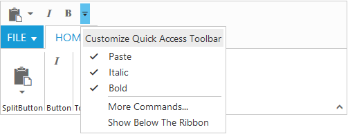

# Quick Access Toolbar

Quick Access Toolbar provides the shortcuts to the most commonly used commands by placing the controls at the Quick Access Toolbar section. It can be placed at the top or bottom of the Ribbon.

Set `showQAT` as true to enable Quick Access Toolbar in Ribbon. It supports the Button, Split Button, Toggle Button controls. The `quickAccessMode` is used to change the controls state in Quick Access Toolbar through options as `toolbar`,`menu` and `none`. Default value is `none` and QAT toolbar is created with specified controls added in Toolbar.

The `toolbar` option used to set controls visibility in Quick Access Toolbar.The `menu` option shows the controls in Quick Access Menu and does not show controls in Quick Access Toolbar.

Once the controls are visible in Toolbar , then controls state will be set as ticked in Quick Access Menu and vice versa.  

The client side event for Quick Access Toolbar menu click is `qatMenuItemClick` and it will be triggered with QAT menu item click.

`More Commands` command provides with Quick Access Menu. This can be customized using `qatMenuItemClick` event, such as to show popup dialog. 



    <%@ page language="java" contentType="text/html; charset=ISO-8859-1"
    pageEncoding="ISO-8859-1"%><%@ taglib prefix="ej" uri="/WEB-INF/EJ.tld" %><%@ page import="com.syncfusion.*" %><%@ page session="false" import="java.util.ArrayList" %><%@ page session="false" import="java.util.Iterator" %><%@ page session="false" import="org.json.simple.parser.JSONParser" %>
    <link rel="stylesheet" href="Content/ejthemes/ribbon-css/ej.icons.css" >
	<body>
		<ul id="ribbonmenu">
			<li>
				<a>FILE</a>
				<ul>
					<li>
						<a>New</a>
					</li>
					<li>
						<a>Open</a>
					</li>
					
				</ul>
			</li>
		</ul>
		
<%
    JSONParser parser = new JSONParser();
	request.setAttribute("paste_buttonSettings",parser.parse("{\"contentType\": \"imageonly\",\"prefixIcon\": \"e-icon e-ribbon e-ribbonpaste\" }"));
	request.setAttribute("italic_buttonSettings",parser.parse("{\"contentType\": \"textandimage\",\"prefixIcon\": \"e-icon e-ribbon e-ribbonitalic\" }"));
	request.setAttribute("bold_buttonSettings",parser.parse("{\"contentType\": \"textandimage\",\"prefixIcon\": \"e-icon e-ribbon e-ribbonbold\" }"));
	%>
			<ej:ribbon id="defaultRibbon" width="100%" showQAT="true">
				<ej:ribbon-applicationTab type="menu" menuItemID="ribbonmenu" ></ej:ribbon-applicationTab>
				<ej:ribbon-tabs>
					<ej:ribbon-tab id="home" text="Home">
						<ej:ribbon-tab-groups>
							<ej:ribbon-tab-group text="Clipboard" alignType="columns">
								<ej:ribbon-tab-group-contentCollection>
									<ej:ribbon-tab-group-content>
										<ej:ribbon-tab-group-content-groups>
											<ej:ribbon-tab-group-content-group id="paste" text="paste" toolTip="Paste"  quickAccessMode="toolbar" buttonSettings="${paste_buttonSettings}"></ej:ribbon-tab-group-content-group>
										</ej:ribbon-tab-group-content-groups>
										<ej:ribbon-tabs-groups-content-defaults type="button" width="50" height="70" isBig="true"></ej:ribbon-tabs-groups-content-defaults>
									</ej:ribbon-tab-group-content>
								</ej:ribbon-tab-group-contentCollection>
							</ej:ribbon-tab-group>
								<ej:ribbon-tab-group text="Button" alignType="columns">
								<ej:ribbon-tab-group-contentCollection>
									<ej:ribbon-tab-group-content>
										<ej:ribbon-tab-group-content-groups>
											<ej:ribbon-tab-group-content-group quickAccessMode="toolbar"  id="italic" toolTip="Italic" buttonSettings="${italic_buttonSettings}"></ej:ribbon-tab-group-content-group>
										</ej:ribbon-tab-group-content-groups>
										<ej:ribbon-tabs-groups-content-defaults type="button" width="60" isBig="false"></ej:ribbon-tabs-groups-content-defaults>
									</ej:ribbon-tab-group-content>
								</ej:ribbon-tab-group-contentCollection>
							</ej:ribbon-tab-group>
							
							<ej:ribbon-tab-group text="Togglebutton" alignType="columns">
								<ej:ribbon-tab-group-contentCollection>
									<ej:ribbon-tab-group-content>
										<ej:ribbon-tab-group-content-groups>
											<ej:ribbon-tab-group-content-group quickAccessMode="toolbar" type="toggleButton" id="bold" toolTip="Bold" buttonSettings="${bold_buttonSettings}"></ej:ribbon-tab-group-content-group>
										</ej:ribbon-tab-group-content-groups>
										<ej:ribbon-tabs-groups-content-defaults type="button" width="60" isBig="false"></ej:ribbon-tabs-groups-content-defaults>
									</ej:ribbon-tab-group-content>
								</ej:ribbon-tab-group-contentCollection>
							</ej:ribbon-tab-group>
						</ej:ribbon-tab-groups>
					</ej:ribbon-tab>
				</ej:ribbon-tabs>
			</ej:ribbon>
		

	</body>
	
	 </html>



