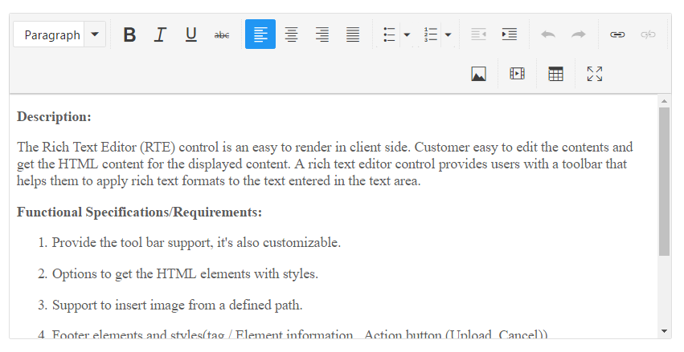
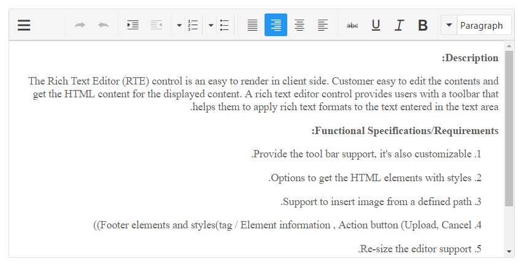

# Getting Started

This section briefly describes about how to create a RichTextEditor in your application with JSP.

This section helps to understand the getting started of RichTextEditor control with the step-by-step instruction.

The external script dependencies of the RichTextEditor widget is,

* jQuery 1.7.1 and later versions.

<table>
	<tr>
		<th>File </th>
		<th>Description / Usage </th>
	</tr>
	<tr>
		<td>ej.core.min.js</td>
		<td>Must be referred always before using all the controls.</td>
	</tr>
	<tr>
		<td>ej.data.min.js</td>
		<td>Used to handle data operation and should be used while binding data to controls.</td>
	</tr>
	<tr>
		<td>ej.scroller.min.js</td>
		<td>Should be referred when using scroller in RichTextEditor.</td>
	</tr>
	<tr>
		<td>ej.draggable.min.js</td>
		<td>Should be referred when using dragging in RichTextEditor.</td>
	</tr>
	<tr>
		<td>ej.button.min.js</td>
		<td>Should be referred when using togglebutton in RichTextEditor.</td>
	</tr>
	<tr>
		<td>ej.splitbutton.min.js</td>
		<td>Should be referred when using splitbutton in RichTextEditor.</td>
	</tr>
	<tr>
		<td>ej.checkbox.min.js</td>
		<td>Should be referred when using checkbox in RichTextEditor.</td>
	</tr>
	<tr>
		<td>ej.radiobutton.min.js</td>
		<td>Should be referred when using radiobutton in RichTextEditor.</td>
	</tr>
	<tr>
		<td>ej.dropdownlist.min.js</td>
		<td>Should be referred when using dropdownlist in RichTextEditor.</td>
	</tr>
	<tr>
		<td>ej.dialog.min.js</td>
		<td>Should be referred when using dialog in RichTextEditor.</td>
	</tr>
	<tr>
		<td>ej.toolbar.min.js</td>
		<td>Should be referred when using toolbar in RichTextEditor.</td>
	</tr>
	<tr>
		<td>ej.editor.min.js</td>
		<td>Should be referred when using editor in RichTextEditor.</td>
	</tr>
	<tr>
		<td>ej.menu.min.js</td>
		<td>Should be referred when using menu in RichTextEditor.</td>
	</tr>
	<tr>
		<td>ej.tab.min.js</td>
		<td>Should be referred when using tab in RichTextEditor.</td>
	</tr>
	<tr>
		<td>ej.slider.min.js</td>
		<td>Should be referred when using slider in RichTextEditor.</td>
	</tr>
	<tr>
		<td>ej.treeview.min.js</td>
		<td>Should be referred when using treeview in RichTextEditor.</td>
	</tr>
	<tr>
		<td>ej.uploadbox.min.js</td>
		<td>Should be referred when using uploadbox in RichTextEditor.</td>
	</tr>
	<tr>
		<td>ej.splitter.min.js</td>
		<td>Should be referred when using splitter in RichTextEditor.</td>
	</tr>
	<tr>
		<td>ej.colorpicker.min.js</td>
		<td>Should be referred when using colorpicker in RichTextEditor.</td>
	</tr>
	<tr>
		<td>ej.fileexplorer.min.js</td>
		<td>Should be referred when using fileexplorer in RichTextEditor.</td>
	</tr>
	<tr>
		<td>ej.grid.min.js</td>
		<td>Should be referred when using grid in RichTextEditor.</td>
	</tr>
	<tr>
		<td>ej.tooltip.min.js</td>
		<td>Should be referred when using tooltip in RichTextEditor.</td>
	</tr>
</table>
		
For getting started you can use the ‘ej.web.all.min.js’ file, which encapsulates all the ‘ej’ controls and frameworks in one single file.
For themes, you can use the ‘ej.web.all.min.css’ CDN link from the snippet given. To add the themes in your application, please refer this link.

## Create a simple RichTextEditor in JSP

You can create an JSP application and add necessary scripts with the help of the given [JSP Getting Started Documentation.](/jsp-docs/jsp/Getting-Started).

The RichTextEditor can be created in JSP by using the below given code.



<ej:rte id="rteSample" width="100%">
		<ej:rte-contentTemplate>
			&lt;p&gt;&lt;b&gt;Description:&lt;/b&gt;&lt;/p&gt;
		    &lt;p&gt;The Rich Text Editor (RTE) control is an easy to render in
		    client side. Customer easy to edit the contents and get the HTML content for
		    the displayed content. A rich text editor control provides users with a toolbar
		    that helps them to apply rich text formats to the text entered in the text
		    area. &lt;/p&gt;
		    &lt;p&gt;&lt;b&gt;Functional
		    Specifications/Requirements:&lt;/b&gt;&lt;/p&gt;
		    &lt;ol&gt;&lt;li&gt;&lt;p&gt;Provide
		    the tool bar support, it's also customizable.&lt;/p&gt;&lt;/li&gt;&lt;li&gt;&lt;p&gt;Options
		    to get the HTML elements with styles.&lt;/p&gt;&lt;/li&gt;&lt;li&gt;&lt;p&gt;Support
		    to insert image from a defined path.&lt;/p&gt;&lt;/li&gt;&lt;li&gt;&lt;p&gt;Footer
		    elements and styles(tag / Element information , Action button (Upload, Cancel))&lt;/p&gt;&lt;/li&gt;&lt;li&gt;&lt;p&gt;Re-size
		    the editor support. &lt;/p&gt;&lt;/li&gt;&lt;li&gt;&lt;p&gt;Provide
		    efficient public methods and client side events.&lt;/p&gt;&lt;/li&gt;&lt;li&gt;&lt;p&gt;Keyboard
		    navigation support.&lt;/p&gt;&lt;/li&gt;&lt;/ol&gt;
		</ej:rte-contentTemplate>
	</ej:rte>	


	
You can execute the above code example to display the RichTextEditor control.

 
## Configuring the RichTextEditor

This section encompasses the details on how to configure the RichTextEditor component with its API properties like enableRTL, isResponsive.



<ej:rte id="rteSample" isResponsive="true" enableRTL="true" width="100%">
		<ej:rte-contentTemplate>
			&lt;p&gt;&lt;b&gt;Description:&lt;/b&gt;&lt;/p&gt;
		    &lt;p&gt;The Rich Text Editor (RTE) control is an easy to render in
		    client side. Customer easy to edit the contents and get the HTML content for
		    the displayed content. A rich text editor control provides users with a toolbar
		    that helps them to apply rich text formats to the text entered in the text
		    area. &lt;/p&gt;
		    &lt;p&gt;&lt;b&gt;Functional
		    Specifications/Requirements:&lt;/b&gt;&lt;/p&gt;
		    &lt;ol&gt;&lt;li&gt;&lt;p&gt;Provide
		    the tool bar support, it's also customizable.&lt;/p&gt;&lt;/li&gt;&lt;li&gt;&lt;p&gt;Options
		    to get the HTML elements with styles.&lt;/p&gt;&lt;/li&gt;&lt;li&gt;&lt;p&gt;Support
		    to insert image from a defined path.&lt;/p&gt;&lt;/li&gt;&lt;li&gt;&lt;p&gt;Footer
		    elements and styles(tag / Element information , Action button (Upload, Cancel))&lt;/p&gt;&lt;/li&gt;&lt;li&gt;&lt;p&gt;Re-size
		    the editor support. &lt;/p&gt;&lt;/li&gt;&lt;li&gt;&lt;p&gt;Provide
		    efficient public methods and client side events.&lt;/p&gt;&lt;/li&gt;&lt;li&gt;&lt;p&gt;Keyboard
		    navigation support.&lt;/p&gt;&lt;/li&gt;&lt;/ol&gt;
		</ej:rte-contentTemplate>
	</ej:rte>		



The above code will render the following output in the display screen 
 

## Setting and Getting Content

You can set the content of the editor as follows.



<ej:rte id="rteSample" value="The Rich Text Editor (RTE) control is an easy to render in client side. Customer easy to edit the contents and get the HTML content for the displayed content" width="100%">
		<ej:rte-contentTemplate>
			&lt;p&gt;&lt;b&gt;Description:&lt;/b&gt;&lt;/p&gt;
		    &lt;p&gt;The Rich Text Editor (RTE) control is an easy to render in
		    client side. Customer easy to edit the contents and get the HTML content for
		    the displayed content. A rich text editor control provides users with a toolbar
		    that helps them to apply rich text formats to the text entered in the text
		    area. &lt;/p&gt;
		    &lt;p&gt;&lt;b&gt;Functional
		    Specifications/Requirements:&lt;/b&gt;&lt;/p&gt;
		    &lt;ol&gt;&lt;li&gt;&lt;p&gt;Provide
		    the tool bar support, it's also customizable.&lt;/p&gt;&lt;/li&gt;&lt;li&gt;&lt;p&gt;Options
		    to get the HTML elements with styles.&lt;/p&gt;&lt;/li&gt;&lt;li&gt;&lt;p&gt;Support
		    to insert image from a defined path.&lt;/p&gt;&lt;/li&gt;&lt;li&gt;&lt;p&gt;Footer
		    elements and styles(tag / Element information , Action button (Upload, Cancel))&lt;/p&gt;&lt;/li&gt;&lt;li&gt;&lt;p&gt;Re-size
		    the editor support. &lt;/p&gt;&lt;/li&gt;&lt;li&gt;&lt;p&gt;Provide
		    efficient public methods and client side events.&lt;/p&gt;&lt;/li&gt;&lt;li&gt;&lt;p&gt;Keyboard
		    navigation support.&lt;/p&gt;&lt;/li&gt;&lt;/ol&gt;
		</ej:rte-contentTemplate>
	</ej:rte>	



