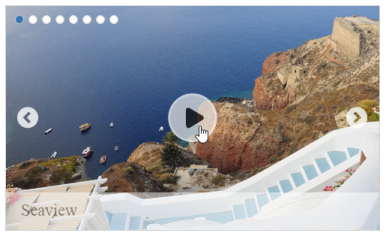

# Getting Started

This section helps to understand the getting started of the **Rotator** control for JSP.

## Create a Rotator

The following steps guide you to add a Rotator control.

Create a new HTML file and include the below scripts and styles for rendering Essential JavaScript controls.



    <head>
        <title>JSP Application</title>
        <link href="http://cdn.syncfusion.com/**{{**site.releaseversion**}}**/js/web/flat-azure/ej.web.all.min.css" rel="stylesheet" />
        
        
    </head>



N> Note: For further reference, refer the common JSP Getting Started Documentation to create an application and add necessary scripts and styles for rendering our control.

Create a simple Rotator by adding **ej:rotator** tag for initializing a Rotator control on the application.

    

        <ej:rotator id="rotator" frameSpace="0px"></ej:rotator>

    

## Configure data

To configure images for Rotator control, define the URL and title for images in Datasource. You need to import datasource in JSP sample and access the data in datasource by creating object of it. Refer the below code to assign values for title and URL of images.


    
    package datasource;

    import java.util.ArrayList;

    public class GetRotatorDataSource {
	    ArrayList<RotatorDataSource> data= new ArrayList<RotatorDataSource>();
	
	        public ArrayList<RotatorDataSource> getData(){
                data.add(new RotatorDataSource("Content/images/rotator/sea.jpg","Sea-View"));
                data.add(new RotatorDataSource("Content/images/rotator/snowfall.jpg","Snow Fall"));
                data.add(new RotatorDataSource("Content/images/rotator/tablet.jpg","Tablet"));
                data.add(new RotatorDataSource("Content/images/rotator/nature.jpg","Nature"));
                data.add(new RotatorDataSource("Content/images/rotator/card.jpg","Credit Card"));	
                data.add(new RotatorDataSource("Content/images/rotator/bird.jpg","Beautiful Bird"));	
                data.add(new RotatorDataSource("Content/images/rotator/wheat.jpg","Wheat"));	
                data.add(new RotatorDataSource("Content/images/rotator/night.jpg","Colorful Night"));	return data;
	       }
        }



Define RotatorDataSource with title and images as below:



    package datasource;

    public class RotatorDataSource {

        public String url;
        public String text;

        public RotatorDataSource(String x2,String x3) {
                this.url=x2;
                this.text=x3;

        }
        public String getUrl(){ return this.url;}
        public void setUrl(String url){ this.url = url; }
        public String getText(){return this.text;}
        public void setText(String text){ this.text = text; }
    }



Access the data from datasource by using below code,



    <%
        GetRotatorDataSource obj =new GetRotatorDataSource();
        Object data = obj.getData();
        request.setAttribute("RotatorDataSource", data);
    %>



Refer the below code to render rotator in sample.



    <ej:rotator id="rotator" frameSpace="0px" slideWidth="600px" slideHeight="350px" dataSource="${RotatorDataSource}" displayItemsCount="1" navigateSteps="1" isResponsive="true" pagerPosition="topleft" orientation="horizontal" showPager="true" showCaption="true" >

    </ej:rotator>



N> _Note:_ _You can find the Rotator control properties from the_ [API reference](https://help.syncfusion.com/api/js/ejrotator) _document_
