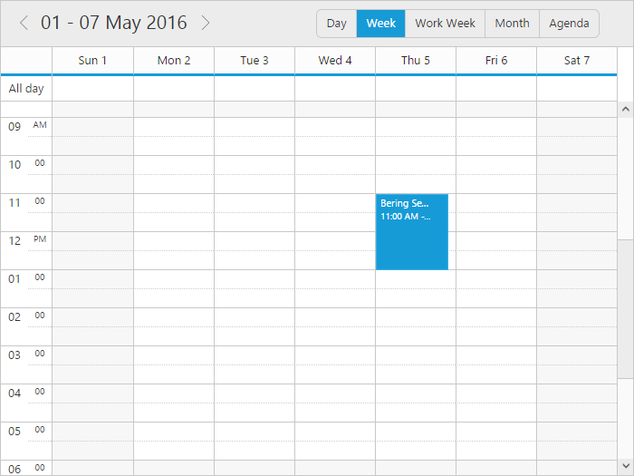

# Getting Started

This section explains briefly about how to create a **Schedule** in your application with JSP.

## Control Initialization

You can create an JSP application and add necessary scripts with the help of the given [JSP Getting Started Documentation](/jsp-docs/jsp/Getting-Started).

Add the scripts and CSS references in the same order mentioned in the following code example.



<%@ page language="java" contentType="text/html; charset=ISO-8859-1" pageEncoding="ISO-8859-1"%>
<%@ page import="com.syncfusion.*"%>
<%@ taglib prefix="ej" uri="/WEB-INF/EJ.tld"%>
<!DOCTYPE html PUBLIC "-//W3C//DTD HTML 4.01 Transitional//EN" "http://www.w3.org/TR/html4/loose.dtd">
<html>
<head>
	<meta http-equiv="Content-Type" content="text/html; charset=ISO-8859-1">
	<title>Essential JSP - Schedule</title>
	<link href="http://cdn.syncfusion.com/{{ site.releaseversion }}/js/web/flat-azure/ej.web.all.min.css" rel="stylesheet" />
	
	
	
</head>
<body>

</body>
</html>



Add ej:schedule tag for initializing the Schedule component on the application.



<ej:schedule id="Schedule1" width="100%" height="525px"></ej:schedule>



## Binding Appointment Data

Set the Scheduler `dataSource`, and define an object of array data. You need to import datasource in JSP sample and access the data in datasource by creating object of it. Refer the below code to define the datasource of Schedule.



package datasource.schedule;

import java.util.*;

public class ScheduleGetDataSource {
	public ArrayList<ScheduleDataSource> getData() {
		ArrayList<ScheduleDataSource> data = new ArrayList<ScheduleDataSource>();
		data.add(new ScheduleDataSource(100, "Bering Sea Gold", new GregorianCalendar(2016, 4, 5, 10, 0).getTime(),	new GregorianCalendar(2016, 4, 5, 11, 0).getTime(), false, false, ""));
		data.add(new ScheduleDataSource(101, "What Happened Next?", new GregorianCalendar(2016, 4, 4, 1, 0).getTime(), new GregorianCalendar(2016, 4, 4, 1, 30).getTime(), false, false, ""));
		data.add(new ScheduleDataSource(102, "Daily Planet", new GregorianCalendar(2016, 4, 3, 1, 0).getTime(),	new GregorianCalendar(2016, 4, 3, 1, 2).getTime(), false, false, ""));
		data.add(new ScheduleDataSource(103, "MoonShiners", new GregorianCalendar(2016, 4, 2, 4, 0).getTime(), new GregorianCalendar(2016, 4, 2, 5, 30).getTime(), false, true, "FREQ=DAILY;INTERVAL=1;COUNT=5"));
		return data;
	}
}

package datasource.schedule;

import java.util.*;

public class ScheduleDataSource {
	public int Id;
	public String Subject;
	public Date StartTime;
	public Date EndTime;
	public Boolean AllDay;
	public Boolean Recurrence;
	public String RecurrenceRule;
	public ScheduleDataSource(int Id, String Subject, Date StartTime, Date EndTime, Boolean AllDay, Boolean Recurrence, String RecurrenceRule) {
		this.Id = Id;
		this.Subject = Subject;
		this.StartTime = StartTime;
		this.EndTime = EndTime;
		this.AllDay = AllDay;
		this.Recurrence = Recurrence;
		this.RecurrenceRule = RecurrenceRule;
	}
}



Access the data from datasource by using below code,



<%@ page import="datasource.schedule.*"%>
<%@ page import="java.util.ArrayList"%>
<%@ page import="java.util.Date"%>
<%@ page import="java.text.SimpleDateFormat"%>
<%
	ScheduleGetDataSource obj = new ScheduleGetDataSource();
	ArrayList<ScheduleDataSource> scheduleData = obj.getData();
	request.setAttribute("scheduleData", scheduleData);
	Date currentDate = new SimpleDateFormat("yyyy/MM/dd").parse("2016/5/4");
%>



Render the Schedule with datasource by referring the below code.



<ej:schedule id="Schedule1" width="100%" height="525px" currentDate="<%=currentDate%>">
	<ej:schedule-appointmentSettings dataSource="${scheduleData}"
		id="Id"
		subject="Subject"
		description="Description"
		startTime="StartTime"
		endTime="EndTime"
		allDay="AllDay"
		recurrence="Recurrence"
		recurrenceRule="RecurrenceRule">
	</ej:schedule-appointmentSettings>
</ej:schedule>



The Scheduler displays as shown in the below image -

