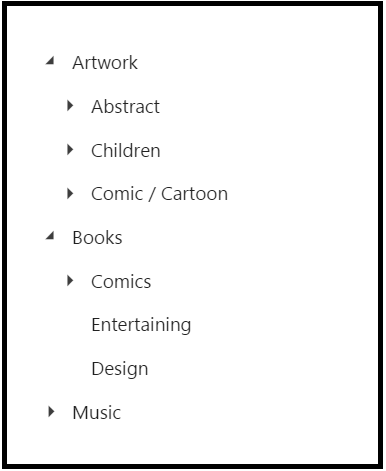

# Getting Started

This section explains briefly about how to create a **TreeView** in your application with JSP.

The usage of **TreeView** control is described in the following sections.

## Create a TreeView in JSP
You can create an JSP application and add necessary scripts with the help of the given [JSP Getting Started Documentation](https://help.syncfusion.com/jsp/getting-started).

Create the JSP file and add the below given code to render **TreeView** control.


     <ej:treeView id="tree">
    <ej:treeview-contentTemplate>
    <ul>
        <li class="expanded">
            Artwork
            <ul>
                <li>
                    Abstract
                    <ul>
                        <li>2 Acrylic Mediums</li>
                        <li>Creative Acrylic</li>
                        <li>Modern Painting</li>
                        <li>Canvas Art</li>
                        <li>Black white</li>
                    </ul>
                </li>
                <li>
                    Children
                    <ul>
                        <li>Preschool Crafts</li>
                        <li>School-age Crafts</li>
                        <li>Fabulous Toddler</li>
                    </ul>
                </li>
                <li>
                    Comic / Cartoon
                    <ul>
                        <li>Batman</li>
                        <li>Adventures of Superman</li>
                        <li>Super boy</li>
                    </ul>
                </li>
            </ul>
        </li>
        <li class="expanded">
            Books
            <ul>
                <li>
                    Comics
                    <ul>
                        <li>The Flash</li>
                        <li>Human Target</li>
                        <li>Birds of Prey</li>
                    </ul>
                </li>
                <li>Entertaining</li>
                <li>Design</li>
            </ul>
        </li>
        <li>
            Music
            <ul>
                <li>
                    Classical
                    <ul>
                        <li>Medieval</li>
                        <li>Orchestral</li>
                    </ul>
                </li>
                <li>Mass</li>
                <li>Folk</li>
            </ul>
        </li>
    </ul>
    </ej:treeview-contentTemplate>
    </ej:treeView>
      


You can execute the above code example to display the **TreeView** control.

 

## Data Binding

The data for TreeView which can be populated using the dataSource property.

The [beforeLoad](https://help.syncfusion.com/api/js/ejtreeview#events:beforeload) event will be triggered before loading nodes into TreeView.

To configure data for TreeView component, define an object array data. You need to import datasource in JSP sample and access the data in datasource by creating object of it. Refer the below code to define the datasource for the TreeView.



package datasource.treeview;

import java.util.ArrayList;

public class GetTreeDataSource {
	public ArrayList<TreeDataSource> getData() {
		ArrayList<TreeDataSource> data = new ArrayList<TreeDataSource>();		
		data.add(new TreeDataSource(1, "Discover Music", 0, true, true));
		data.add(new TreeDataSource(2, "Hot Singles", 1, false, false));
		data.add(new TreeDataSource(3, "Rising Artists", 1, false, false));
		data.add(new TreeDataSource(4, "Live Music", 1, false, false));
		data.add(new TreeDataSource(5, "Best of 2013 So Far", 1, false, false));
		data.add(new TreeDataSource(6, "Sales and Events", 0, true, true));
		data.add(new TreeDataSource(7, "100 Albums - $5 Each", 6, false, false));
		data.add(new TreeDataSource(8, "Hip-Hop and R&B Sale", 6, false, false));
		data.add(new TreeDataSource(9, "CD Deals", 6, false, false));
		data.add(new TreeDataSource(10, "Categories", 0, true, false));
		data.add(new TreeDataSource(11, "Songs", 10, false, false));
		data.add(new TreeDataSource(12, "Bestselling Albums", 10, false, false));
		data.add(new TreeDataSource(13, "New Releases", 10, false, false));
		data.add(new TreeDataSource(14, "Bestselling Songs", 10, false, false));
		return data;
	}
}



Access the data from datasource by using below code,



<%
   GetTreeDataSource obj = new GetTreeDataSource();
	ArrayList<TreeDataSource> treeData = obj.getData();
	request.setAttribute("treeData", treeData);	
   %>



Refer the below code to render TreeView with local datasource.



<ej:treeView id="tree">
<ej:treeView-fields id="Id" dataSource="${treeData}" 
	parentId="PId" text="Name" hasChild="HasChild" expanded="Expanded">
</ej:treeView-fields>
</ej:treeView>



Run the above code to get the following output.

 
